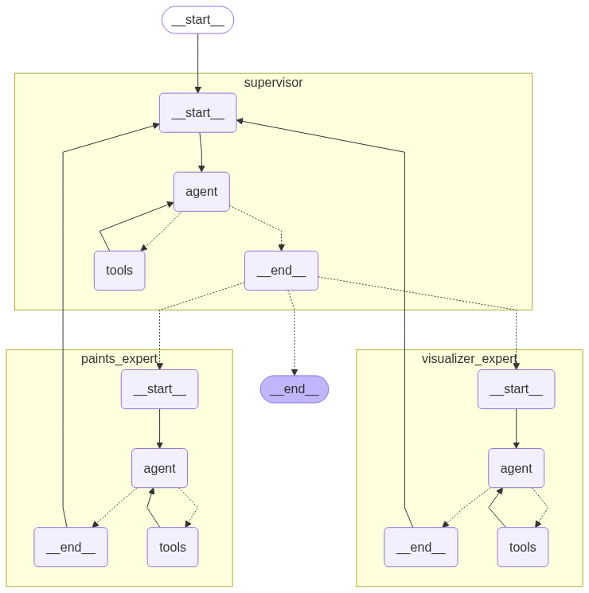

# 💻 PintAI

PintAI é um Catálogo Inteligente de Tintas com IA. O projeto consiste em um Assistente Virtual especializado em tintas, capaz de recomendar o produto Suvinil ideal para cada pessoa, considerando seu contexto, dúvidas e preferências. Utilizando inteligência artificial, o PintAI atua como um especialista, facilitando a escolha da tinta mais adequada para cada situação.

<!--ts-->
* [📋 Requisitos](#requisitos)
* [⚙️ Setup do Projeto](#setup-do-projeto)
* [🐋 Rodar com Docker](#rodar-com-docker)
* [💻 Rodar localmente](#rodar-localmente)
* [ "Arquitetura" de solução IA](#arquitetura-de-solução-ia)
  * [🧠 Ferramentas de IA Utilizadas](#🧠-ferramentas-de-ia-utilizadas)
  * [💬 Exemplos de Prompts Utilizados](#💬-exemplos-de-prompts-utilizados)
  * [🛠️ Decisões Técnicas Baseadas nas Sugestões](#🛠️-decisões-técnicas-baseadas-nas-sugestões)
* [📁 Estrutura de Pastas](#estrutura-de-pastas)
<!--te-->


# Requisitos
### Para usar com Docker:
- [Docker](https://www.docker.com/products/docker-desktop)
- [Docker Compose](https://docs.docker.com/compose/install/)

### Para rodar localmente:
- [Python 3.13.5](https://www.python.org/downloads/release/python-3135/)
- [PostgreSQL](https://www.postgresql.org/download/)
- [pgvector](https://github.com/pgvector/pgvector)

# Setup do Projeto

1. Clone o repositório:
  ```bash
  git clone https://github.com/maycon-mdrs/loomi-challenge.git
  ```

2. Antes de rodar o projeto, crie um arquivo `.env` seguindo o modelo do `.env.example`. Este arquivo deve conter todas as variáveis necessárias para o funcionamento do backend e do Docker.

Principais variáveis de ambiente:

| Variável                | Descrição                                      |
|------------------------ |------------------------------------------------|
| DATABASE_USER           | Usuário do banco de dados                      |
| DATABASE_PASSWORD       | Senha do banco de dados                        |
| POSTGRES_DB             | Nome do banco de dados                         |
| DATABASE_URL            | URL de conexão do banco de dados               |
| -                       | -                                              |
| SECRET_KEY              | Chave secreta para autenticação JWT            |
| ALGORITHM               | Algoritmo JWT (ex: HS256)                      |
| -                       | -                                              |
| OPENAI_API_KEY          | Chave da API OpenAI                            |
| LANGSMITH_TRACING       | Ativa/desativa tracing do LangSmith            |
| LANGSMITH_ENDPOINT      | Endpoint do LangSmith                          |
| LANGSMITH_API_KEY       | Chave da API LangSmith                         |
| LANGCHAIN_PROJECT       | Nome do projeto LangChain                      |
| -                       | -                                              |
| MODEL_SUPERVISOR        | Modelo do agente supervisor, ex: gpt-4.1       |
| TEMPERATURE_SUPERVISOR  | Temperatura do supervisor, ex: 0               |
| MODEL_PAINTS            | Modelo do agente de tintas, ex: gpt-4.1        |
| TEMPERATURE_PAINTS      | Temperatura do agente de tintas, ex: 0         |
| MODEL_VIZUALIZER        | Modelo do agente visualizador, ex: gpt-4.1     |
| TEMPERATURE_VIZUALIZER  | Temperatura do agente visualizador, ex: 0      |

### Exemplo de uso de _DATABASE_URL_ no .env
```bash
# docker-compose
DATABASE_URL="postgresql+psycopg2://postgres/loomi?user=postgres&password={password}"

# desenvolvimento local
DATABASE_URL="postgresql+psycopg2://localhost/loomi?user=postgres&password={password}"
```


# Rodar com Docker

Para rodar o projeto com Docker, utilize o comando:
```bash
docker-compose up -d --build
# http://localhost:8080/api/v1/
# http://localhost:8080/docs
```

# Rodar localmente

### Criação do ambiente virtual
```bash
python -m venv venv
```

### Ativar o ambiente virtual
```bash
# Windows
.\venv\Scripts\activate
# Linux/macOS
source venv/bin/activate
```

### Instalar dependências
```bash
pip install -r requirements.txt
```

### Migrar o banco de dados
```bash
alembic upgrade head
```

### Iniciar aplicação
```bash
uvicorn app.main:app --reload
# http://localhost:8000/api/v1/
# http://localhost:8000/docs
```


# "Arquitetura" de solução IA



### 🧠 Ferramentas de IA Utilizadas

- **OpenAI GPT (ChatGPT, Assistants API, Embeddings API)**: Utilizado para geração de respostas, engenharia de prompts, RAG e integração com agentes conversacionais.
- **DALL·E**: Geração visual opcional de ambientes pintados com a tinta recomendada.
- **LangChain**: Framework para orquestração de agentes, integração de RAG e gerenciamento de contexto conversacional.
- **LangGraph**: Implementação de agentes reativos e supervisores em grafo.
- **LangSmith**: Monitoramento e análise de aplicações com LLMs.


### 💬 Exemplos de Prompts Utilizados

- "Quero pintar meu quarto, mas prefiro algo que seja fácil de limpar e sem cheiro forte. Tem alguma sugestão?"
- "Preciso pintar a fachada da minha casa. Bate muito sol e chove bastante por aqui. Qual tinta você recomenda?"
- "Você tem alguma tinta para madeira que seja resistente ao calor?"
- "Quero pintar meu escritório com um tom de cinza moderno. Mostra como ficaria?"
- "Quero pintar minha varanda de azul claro, algo moderno e resistente ao tempo. Como ficaria?"

> Para o system prompt base do agente supervisor, encontra-se na pasta `prompts`, os demais prompts estão hardcoded nos agentes específicos, mas podem ser facilmente identificados e extraídos para um local centralizado se necessário.


### 🛠️ Decisões Técnicas Baseadas nas Sugestões
- **Arquitetura**: Separação das camadas de IA e API
- **RAG + Embeddings**: Implementação de busca inteligente na base de tintas usando embeddings e RAG
- **Agentes Multi-Ferramentas**: Uso de agentes capazes de raciocinar e decidir qual ferramenta utilizar (busca, recomendação, geração de imagem), conforme prompts e exemplos sugeridos.
- **Documentação**: Uso de Swagger
- **"Deploy"**: Docker + Docker Compose para garantir portabilidade e fácil validação do ambiente.


# Estrutura de Pastas
```plaintext
app/                  
 ├── core_ai/         # Lógica de IA, integração com modelos e agentes
 │    └── agents/     # Agentes especializados (ex: supervisor, paints, dalle)
 ├── database/        # Conexão, base e armazenamento vetorial do banco 
 ├── DTOs/            
 ├── exceptions/      # Definição e tratamento de exceções customizadas
 ├── models/          # Modelos das entidades do sistema
 ├── repositories/    # Repositórios para acesso e manipulação dos dados
 ├── routes/          # Rotas da API (endpoints)
 ├── services/        # Regras de negócio e serviços da aplicação
 └── utils/           # Funções utilitárias e helpers
```
